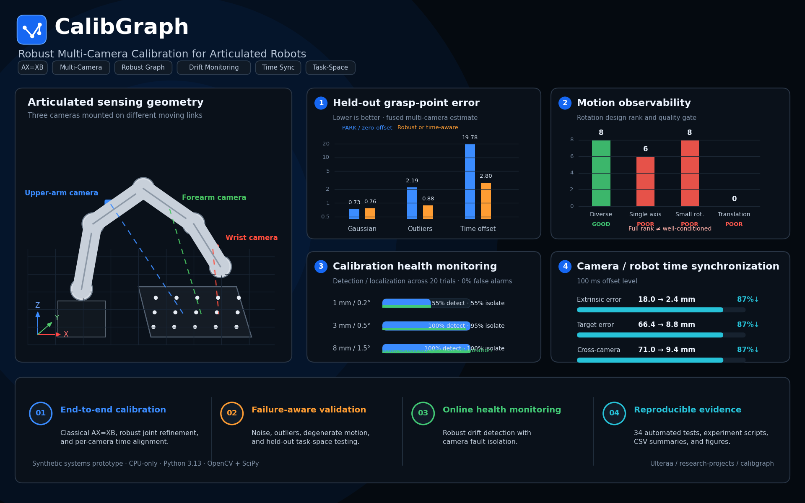

# CalibGraph — Robust Multi-Camera Calibration for Articulated Robots



CalibGraph is a CPU-only synthetic systems prototype for calibrating cameras
mounted on different moving links of an articulated robot. It goes beyond a
single hand–eye solver by combining motion-observability checks, independent
and joint multi-camera calibration, robust outlier handling, online mechanical
drift monitoring, per-camera time-offset estimation, and held-out robot
task-space validation.

> **Validation scope:** all results are from controlled synthetic experiments.
> The project is not presented as real-robot or production-deployed validation.

## Headline results

| Condition | Baseline | CalibGraph method | Held-out result |
|---|---:|---:|---|
| Clean Gaussian observations | PARK: 0.727 mm grasp error | Joint Huber: 0.765 mm | PARK remained the preferred fast baseline |
| 8% gross target-pose outliers | PARK: 2.186 mm | Joint Huber: **0.882 mm** | **59.7% lower** held-out grasp error |
| Camera/robot time mismatch | Zero-offset PARK: 19.783 mm | Time-aware PARK: **2.802 mm** | **85.8% lower** held-out grasp error |
| Medium mount drift: 3 mm / 0.5° | — | Health monitor | 100% detection, 95% camera isolation, 0% false alarms |
| Large mount drift: 8 mm / 1.5° | — | Health monitor | 100% detection, 100% camera isolation, 0% false alarms |

Under outliers, precision-action acceptance increased from
**45.6% to 96.1%**. Under timestamp mismatch,
standard-action acceptance increased from **0% to
90%**.

## System contributions

1. **Classical hand–eye baselines** — TSAI, PARK, HORAUD, ANDREFF, and
   DANIILIDIS through OpenCV.
2. **Motion observability gate** — rotational magnitude, axis diversity, and
   linearized `AX = XB` rotation-design rank.
3. **Articulated multi-camera simulation** — cameras on upper-arm, forearm,
   and wrist/gripper links.
4. **Joint robust refinement** — all camera-to-link extrinsics and one shared
   target pose optimized together with linear or Huber loss.
5. **Calibration health monitoring** — robust median/MAD residual statistics,
   persistent state transitions, and leave-one-camera-out fault isolation.
6. **Camera/robot time synchronization** — alternating estimation of camera
   extrinsics and per-camera timestamp offsets.
7. **Held-out task-space evaluation** — grasp-point, surface-point, approach
   normal, and simulated action-acceptance metrics on separate trajectories.

## Frame convention

`T_A_B` maps coordinates from frame `B` into frame `A`:

```text
p_A = T_A_B @ p_B
T_A_C = T_A_B @ T_B_C
```

For a camera `C_i` mounted on robot link `L_i` and a target `T` fixed in the
robot base `B`:

```text
T_B_T = T_B_L_i(q_t) @ T_L_i_C_i @ T_C_i_T(t)
```

The unknown camera mount is `T_L_i_C_i`.

### Classical hand–eye form

Relative robot and camera motions produce:

```text
A_k X = X B_k
```

where `X = T_L_C`.

### Joint multi-camera factor

For every camera and robot pose, the joint optimizer minimizes the SE(3)
consistency error:

```text
E_i,t = inverse(T_B_T) @ T_B_L_i(t) @ T_L_i_C_i @ T_C_i_T(t)

r_i,t = [
    translation(E_i,t) / sigma_translation,
    LogSO3(rotation(E_i,t)) / sigma_rotation
]
```

### Time-aware calibration

A camera observation may correspond to a shifted robot timestamp:

```text
T_B_T =
    T_B_L_i(t + delta_i)
    @ T_L_i_C_i
    @ T_C_i_T(t)
```

CalibGraph alternates between extrinsic calibration and bounded per-camera
offset estimation.

### Health score and camera isolation

Robust normalized residuals use the calibration-window median and MAD:

```text
z = max(0, (error - median(error)) / max(1.4826 * MAD, minimum_scale))
health = sqrt(z_translation² + z_rotation² + z_cross_camera²)
```

The likely faulty camera is identified with a leave-one-camera-out score:

```text
isolation(i)
  = mean distance(camera i, peers)
    - mean distance among the peers
```

## Installation

```bash
python3 -m venv .venv
source .venv/bin/activate
python -m pip install --upgrade pip
python -m pip install -r requirements.txt
python -m pip install -e .
python -m pytest -q
```

Validated final test result:

```text
34 passed
```

## Reproducing the experiments

```bash
python scripts/benchmark_zero_noise.py
python scripts/benchmark_target_pose_noise.py
python scripts/benchmark_motion_observability.py
python scripts/benchmark_multicamera_independent.py
python scripts/benchmark_joint_multicamera.py
python scripts/benchmark_drift_monitoring.py
python scripts/benchmark_time_synchronization.py
python scripts/benchmark_task_space_validation.py
```

Each script writes machine-readable CSV summaries and publication-ready plots
under `results/`.

## Project structure

```text
calibgraph/
├── calibgraph/
│   ├── baselines/      # OpenCV AX=XB and independent multi-camera solvers
│   ├── evaluation/     # Calibration, observability, time-sync, task metrics
│   ├── experiments/    # Phase benchmarks
│   ├── geometry/       # SE(3) and Lie parameterization utilities
│   ├── graph/          # Joint robust and time-offset optimization
│   ├── monitoring/     # Health state and drift isolation
│   └── simulation/     # Synthetic articulated robot and corruption models
├── scripts/
├── tests/
├── results/
├── figures/
├── README_PHASE1.md ... README_PHASE9.md
├── requirements.txt
└── pyproject.toml
```

## Evidence and interpretation

- Diverse multi-axis robot motion produced a rank-8 rotation system and stable
  sub-millimeter estimates.
- Single-axis and translation-only motion were rank-deficient.
- Tiny rotations could be algebraically full-rank while remaining practically
  ill-conditioned.
- Joint least squares was not universally better: under clean data, PARK was
  faster and more accurate.
- Robust joint optimization became valuable when observation outliers violated
  the clean-noise assumptions.
- Timestamp mismatch produced large apparent extrinsic errors and had to be
  estimated explicitly.
- The health monitor detected meaningful mount drift without triggering on
  the no-drift sequences.

## Limitations

- Synthetic data only; no physical robot or real camera validation.
- Target poses are simulated directly rather than estimated from raw images and
  corner detections.
- The kinematic model is exact except in explicitly injected corruption studies.
- The time-aware solver is offline and substantially slower than closed-form
  PARK.
- Acceptance thresholds are simulated geometric criteria, not claims about a
  particular robot, end effector, or industrial cell.
- With three cameras, leave-one-out isolation assumes the two non-faulty peers
  remain mutually consistent.

## Intended use

This repository is a reproducible research and portfolio prototype for
multi-camera calibration system design. It is intended for experimentation,
technical discussion, and extension—not as a drop-in safety-certified
calibration package.
